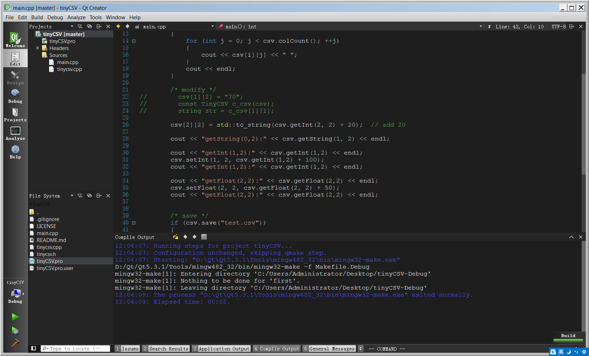

##概览
先看一下最终的效果图，与VS2013深色主题相近的代码配色和界面配色，是不是有点心动了呢？

##安装和使用

####（1）配置代码编辑区域的配色方案
先下载配置文件 vs2013_dark.xml，拷贝到QtCreator安装目录下的"QtCreator\share\qtcreator\styles"目录下。然后启动QtCreator打开"Tools"->"Options"，在"Text Editor"界面中的"Color Scheme"下拉框中选择"vs2013_dark"这个配色方案，点击"应用"即可生效，下次启动依然有效。
    
设置之后的程序效果图：

####（2）配置其他区域的颜色主题为黑色
这一步是可选的，经过第（1）步代码的编辑区域已经是VS2013深色主题风格了，但是其他区域（如项目列表、程序输出面板等）显示为白色背景，反差较大，如果将其调成黑色看起来更舒服。方法是：将下面文件dark.css拷贝到qtcreator程序所在的目录"QtCreator\bin"，然后在命令行启动QtCreator:
格式如下：
> [path to qtcreator] -stylesheet [path to dark.css]    

如果当前处于QtCreator程序目录，则输入：
> qtcreator -stylesheet dark.css

可以看到程序启动，并显示前面你所见到的效果。

在Window上为了方便，可以给程序创建一个快捷方式，并添加一个启动参数，这样不用每次在命令行输入参数了。在QtCreator的快捷方式上点击右键属性，在Target一栏输入参数，这样下次通过该快捷方式启动QtCreator即可获得效果。
